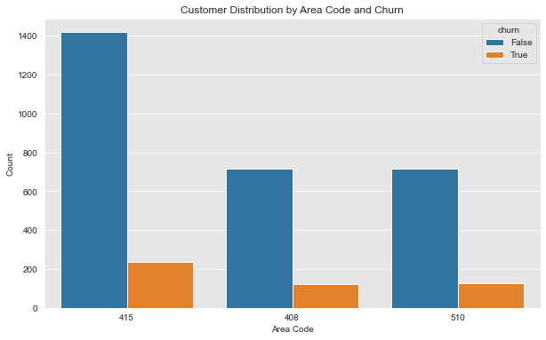
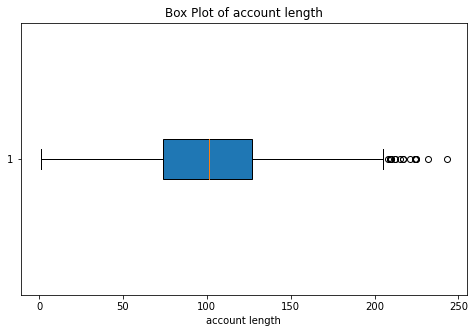

# Phase 3 Project
## SyriaTel Customer Churn Prediction
### Project Overview
## 1. Business Problem
Customer retention is at the heart of every thriving Telecom company. Managing and reducing customer churn is essential for maintaining revenue, profitability and market share. By focusing on churn reduction, telecom companies can enhance customer satisfaction, increase the lifetime value of their customers, and secure a stronger position in the competitive market. SyriaTelecommunication is well aware of the common marketplace comment that "it is cheaper to retain a converted customer than acquire a new client. As a result, I have been tasked to build a classification model that will predict whether a customer will soon stop doing business with them. 

The research at hand delves into machine learning algorithms and offers recommendations tailored to the telecommunications industry. In a competitive telecom sector where customers can effortlessly switch from one provider to another, telecom companies are understandably concerned about customer retention and devising strategies to retain their clientele. By preemptively identifying customers likely to switch providers through behavioral analysis, they can devise targeted offers and services based on historical records. 

The core objective of this study is to predict churn in advance and pinpoint the primary factors that may influence customers to migrate to other telecom providers. The project will explore various machine learning algorithms, including logistic regression and decision trees to develop a robust churn prediction model. Model performance will be evaluated using metrics such as accuracy, precision, recall, and AUC-ROC to ensure the best possible outcomes. This will provide the insight the board members need when making policies and procedures that will enable the business gear towards retaining the customers and continue being relevant in the marketplace.

See below questions the project aims to answer:
1. What is the churn current % rate.
2. What features/attributes do the customers who churn have.
3. What strategies can SyriaTel implement to increase customer retention.

## Business Objectives
Develop a predictive model that accurately identifies customers who are at risk of churning (leaving the service) within the next three months, achieving an overall model accuracy of at least 85%, while maintaining a recall rate of at least 70% for the churn class

## Data Mining Objective
Build a classification model that predicts whether a customer will churn or not within the next three months.

## 2. Data Understanding
This project utilizes the SyriaTel dataset, which was downloaded from Kaggle and contains about 3333 records in terms of the rows and 21 columns in totality. The data is stored in the file named SyriaTel_Customer_Churn.csv. As part of understanding our data, we noted that our dataset does not contain any missing values but the target variable is imbalanced. Majority of the variable is the no churn while the minority is the churn rate. We also considered building a model having addressed this class imbalance issue with the SMOTE technique. From our data we also noted that the column 'phone number' is the unique identifier as it contained 3333 unique values.

See below columns and what they represent:
* State: The geographical location of the customer.
* Account Length: How long the customer held their account.
* Area Code: Customer's phone number area code.
* Phone Number: Customer's mobile number.
* International Plan: A indicator of whether the customer has an international plan or not.
* Voice Mail Plan: An indicator whether the customer has a voice mail plan.
* Number Vmail Messages: How many voicemail messages the customer has.
* Total Day Minutes: Total minutes the customers spend on a call in the day.
* Total Day Calls: Total number of calls the customer made in a day.
* Total Day Charge: Total charge incrued for the day calls.
* Total Eve Minutes: Total minutes the customers spend on a call in the evening.
* Total Eve Calls: Total number of calls the customer made in a evening.
* Total Eve Charge: Total charge incrued for the evening calls
* Total Night Minutes: Total minutes the customers spend on a call in the night.
* Total Night Calls: Total number of calls the customer made in a night.
* Total Night Charge: Total charge incrued for the day night.
* Total Intl Minutes: Total minutes spent on an international call.
* Total Intl Calls: Total international calls made.
* Total Intl Charge: Total charge incured on the international plan.
* Customer Service Calls: How many calls the customer made for support to SyriaTel.
* Churn: Target variable indicating whether the customer has churned (True) or not churn (False) respectively.

All the other features are potential contributing factors to churn which our project will focus on to eventually tell which features are more significant than the others. 

### EDA Data Analysis Findings:
In this project we installed the python, pandas, numpy and scikit learn libraries.

#### Finding 1: Data Georgaphical Distribution
We identified that we data we have was collected from 3 geographical areas. Area code 415', '408' and '510'. 
The area code with the highest churn number is area code 415 followed by 510 and lastly 408. 
See the visualization:

#### Finding 2: Data Type Conversion
We identified that the 'area code' column, originally an integer, represents categorical labels rather than numerical values. To avoid misinterpretation in our predictive model, we converted this column to a string data type. This ensures the model treats 'area code' correctly as a categorical feature, preserving the integrity of our predictions.

#### Finding 3: Multicollinearity
Our analysis revealed high correlations between several columns, indicating multicollinearity. For instance 'total day charge', 'total day minutes', 'total eve minutes', 'total eve charge', 'total night charge', 'total night minutes', 'total int minutes' and 'total int charge' have perfect multicollinearity. This can obscure the unique impact of each variable and potentially lead to overfitting, particularly in models like Logistic Regression that are sensitive to multicollinearity. To address this, we plan to implement techniques such as regularization, ensuring our models remain reliable and interpretable.

#### Finding 4: Outliers
We observe the presence of a significant number of outliers in our dataset. Outliers have the potential to impact our modeling process. However, it is important to note that, in this case, these outliers are not anomalies that should be removed. Instead, they are a noteworthy aspect of our dataset that we should be aware of during our modeling process. These outliers may carry valuable information or insights that could be relevant to our analysis therefore it is essential to consider and account for them when developing our models and interpreting the results. Understanding the nature and impact of these outliers is a critical part of ensuring the robustness and accuracy of our data analysis.

Adding regularization to our model can help reduce the impact of outliers by penalizing extreme parameter values, making the model more generalizable and robust

#### Finding 5: Class Imbalance
From the target variable above we saw that the churn class value count was 483 whereas the no churn count was 2850. We note a significant class imbalance here where the churn is the minority class and not churn is the majority class. This is common in churn datasets.

85.5% customer did not churn while 14.5% customers churned. The imbalance means that a model trained without addressing this issue will be biased toward predicting the majority class (customers not churning). This will lead to high accuracy but poor performance in identifying actual churners.

We will address class imbalance using a technique such as SMOTE before modeling to balance the 'churn' and 'not churn' classes. This should help improve overall model metrics like Precision, Recall, F1-score, and AUC-ROC. In imbalanced datasets, a model may achieve high accuracy by being biased toward the majority class, but this metric alone would be misleading and not truly reflective of the model's performance on the minority class which is what our model is meant to predict.

### Data Preprocessing
1. Data Splitting: 
We performed this step before preprocessing in order to prevent data leakage. This ensures that the test data remains completely unseen until the evaluation phase. Use the random state of 42 and a test size of 20%. 
2. Handling Missing Data:
We did not have missing data therefore there isnt much to handle here in this preprocessing step.
3. Encoding Categorical Variables:
The 2 features 'international plan' and 'voice mail plan' and  that are in the datatype object. We shall proceed to convert this variables to dummy ohe using the OneHotEncoder from sklearn.
4. Data Normalization using MinMaxScaler:
MinMaxScaler with default parameters will create a maximum value of 1 and a minimum value of 0. This will work well with our binary one-hot encoded data.
5. Concatenating the Normalized and OheHotEncoded Train and Test Data:
This is done to create a final dataframe with the ohehotencoded and normalized set for both the trained and tested sets.
6. Feature Selection Using Domain Knowledge:
We proceeded to select our features using domain knowledge. From our dataset we eliminated the columns: area code, phone number and state as we did not find this columns relevant in our business problem.

## 3. Modeling
#### Model Selection:
Since this is a classification problem our first model will be  **Logistic Regression** as it has a binary target variable then followed by **Decision Trees** as it a powerful and flexible tool for classification problems, offering ease of interpretation, handling non-linear relationships, and providing automatic feature selection.
First we train our logistic regression baseline model with the imbalanced target variables.
As we fit our model, we also generated the confusion matrix seen below:

Our second logistic regression iterative model was done after class imbalance using the technique SMOTE was implemented. We also employed the regularization technique and used a lower C value. The random_state of 42 was maintained.

The Decision tree baseline model was trained using the Decision Tree Classifier, criterion=entropy and the same random state was maintained.

We second Decision tree iterative model had manually tuned step by step parameters that is max_features, max_depth, min_sample_splits, min_sample_leafs. We used the manually obtained optimum values of each feature to train our model.

Our last decision tree model was modified by grid search technique. We obtained the best parameters: {'criterion': 'gini', 'max_depth': 10, 'min_samples_leaf': 4, 'min_samples_split': 10}. This was used to train our 3rd iterative model.

## 4 . Evaluation